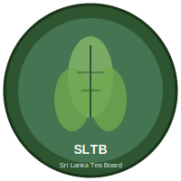

# Assets Directory

This directory contains the visual assets for the SLTB Payment Voucher System.

## Current Assets

### 1. SLTB Logo (`sltb-logo.svg`)
- **Current**: Placeholder SVG logo with tea leaf design
- **Size**: 200x200 pixels
- **Format**: SVG (Scalable Vector Graphics)
- **Usage**: Displayed in the application header

### 2. Application Icon (`icon.svg`)
- **Current**: Placeholder SVG icon matching the logo design  
- **Size**: 256x256 pixels
- **Format**: SVG (Scalable Vector Graphics)
- **Usage**: Application icon in taskbar and window

## How to Replace with Actual SLTB Logo

### Option 1: Replace SVG Files (Recommended)
1. **For the application logo:**
   - Replace `sltb-logo.svg` with your official SLTB logo in SVG format
   - Ensure the file is named exactly `sltb-logo.svg`
   - Recommended size: 200x200 pixels or scalable

2. **For the application icon:**
   - Replace `icon.svg` with your official SLTB icon in SVG format
   - Ensure the file is named exactly `icon.svg`
   - Recommended size: 256x256 pixels or scalable

### Option 2: Use PNG Files
1. **For the application logo:**
   - Add your logo as `sltb-logo.png` (200x200 pixels recommended)
   - Update `src/index.html` line 17 to use `.png` instead of `.svg`

2. **For the application icon:**
   - Add your icon as `icon.png` (256x256 pixels recommended)
   - Update `main.js` line 15 to use `.png` instead of `.svg`

### Option 3: Use ICO Files (Windows-specific)
For better Windows integration:
1. Convert your logo to ICO format with multiple sizes (16x16, 32x32, 48x48, 256x256)
2. Save as `icon.ico`
3. Update `main.js` line 15 to use `icon.ico`
4. Update `package.json` build configuration to reference the ICO file

## File Format Guidelines

### SVG Format (Recommended)
- ✅ Scalable to any size
- ✅ Small file size  
- ✅ Crisp at all resolutions
- ✅ Easy to modify colors/styling

### PNG Format
- ✅ Widely supported
- ✅ Good for complex imagery
- ❌ Fixed resolution
- ❌ Larger file size

### ICO Format (Windows)
- ✅ Native Windows icon format
- ✅ Multiple sizes in one file
- ✅ Better system integration
- ❌ Windows-specific

## Current Placeholder Design

The current placeholder features:
- **Colors**: Green theme matching tea/nature (#2c5530, #4a7c59, #7fb069)
- **Design**: Stylized tea leaves
- **Text**: "SLTB" and "Sri Lanka Tea Board"
- **Style**: Professional, clean, government-appropriate

## Integration Points

The logo/icon files are used in:

1. **Application Header** (`src/index.html`):
   ```html
   
   ```

2. **Application Icon** (`main.js`):
   ```javascript
   icon: path.join(__dirname, 'assets', 'icon.svg')
   ```

3. **PDF Generation** (`src/renderer.js`):
   - Currently uses text header
   - Can be enhanced to embed logo in PDFs

4. **Build Configuration** (`package.json`):
   - Icon referenced for installer/executable

## Notes

- Always backup the original files before replacing
- Test the application after making changes to ensure proper display
- Consider trademark and usage guidelines for official SLTB logos
- SVG files can be edited with any text editor or vector graphics software

---

**For technical support, contact the SLTB IT Division.**